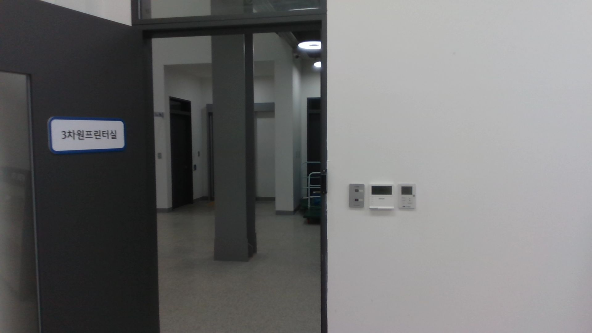
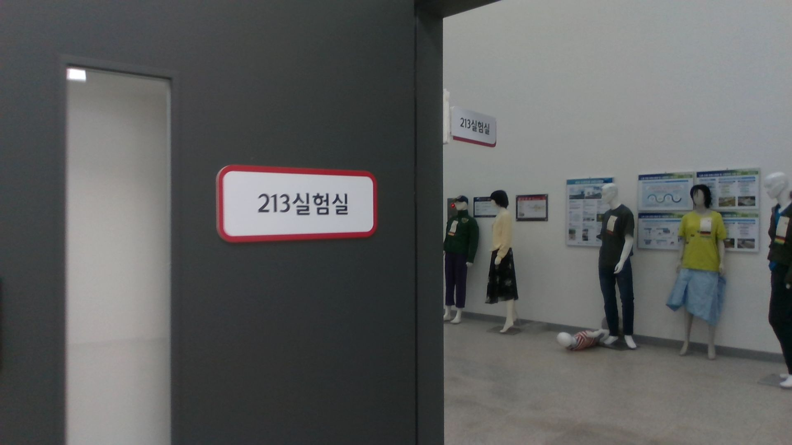
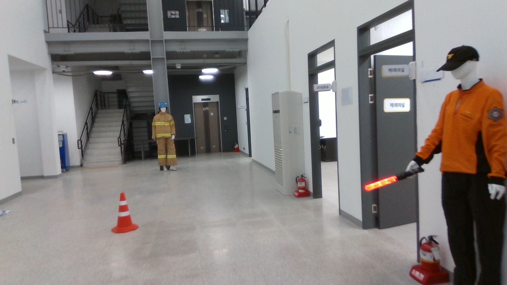
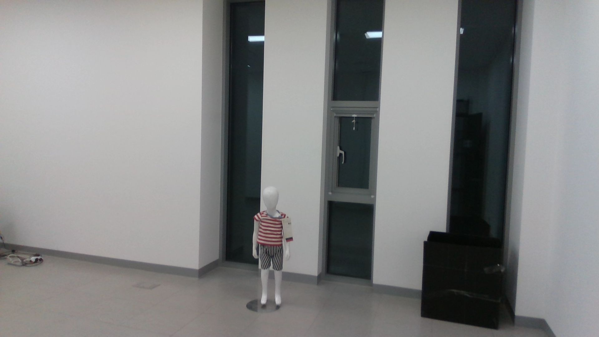

# Human rescue dataset acquired by drones 
## Introduction
 * We have captured ten different virtual indoor rescue scenarios by a drone. The video and audio sets were captured on a drone three times for each sequence. We dressed mannequins as firefighters, rescuers, medical staff, and the general person(male, female, child). We arranged mannequins in a different pose for each scenario, and the audio of the rescue request voice was configured differently(male, female, child).

 * We have captured 30 sets of data for multi-object detection, crowd counting, optical character recognition, speaker recognition, etc. Images were composed of 1920x1080 resolution, and voice data was acquired by a 7-channel microphone (16Khz sampling rate and 1024 chunk size).

## Dataset Example
* Images below are example images from dataset

* OCR example

    
    

* Object recognition example

     
     

## Download
### Please click on the link below to download.
* [Download link](http://gofile.me/5GdTf/nyq5Erduh)

## Acknowledgement

이 데이터는 2022년도 정부(과학기술정보통신부)의 재원으로 정보통신기획평가원의 지원을 받아 수행된 연구의 결과물임 (No.171115245, 인명 구조용 드론을 위한 영상/음성 인지 기술 고도화)

This work was supported by Institute of Information & communications Technology Planning & Evaluation (IITP) grant funded by the Korea government(MSIT) (No. 171115245, Advanced Audio-Visual Perception for Autonomous Rescue Drones)

"이 데이터는 과학기술정보통신부의 재원으로 한국지능정보사회진흥원의 지원을 받아 구축된 "위급상황 음성/음향"을 활용하여 제작된 데이터입니다. 본 데이터에 활용된 데이터는 AI 허브(aihub.or.kr)에서 다운로드 받으실 수 있습니다."